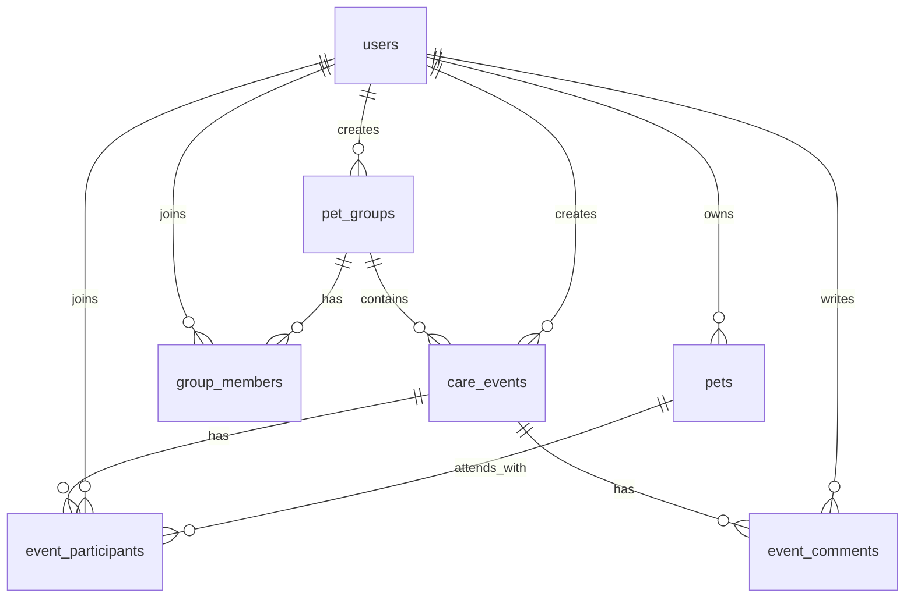

# Database Schema

This document describes the initial Pet Care Planner PostgreSQL schema used by Drizzle ORM.

## ER Diagram

## Tables and Field Types

### `users`

| Field | Type | Notes |
|---|---|---|
| `id` | `serial` | Primary key |
| `email` | `varchar(255)` | Required, unique |
| `password_hash` | `text` | Required, stores hashed password only |
| `name` | `varchar(120)` | Required |
| `role` | `user_role` enum | `user`, `admin`; default `user` |
| `photo_url` | `text` | Optional |
| `created_at` | `timestamp with time zone` | Default now |
| `updated_at` | `timestamp with time zone` | Default now |
| `deleted_at` | `timestamp with time zone` | Optional soft delete |

### `pets`

| Field | Type | Notes |
|---|---|---|
| `id` | `serial` | Primary key |
| `owner_id` | `integer` | FK to `users.id`, cascade delete |
| `name` | `varchar(120)` | Required |
| `type` | `pet_type` enum | `dog`, `cat`, `bird`, `rabbit`, `other` |
| `breed` | `varchar(120)` | Optional |
| `age` | `integer` | Optional |
| `size` | `varchar(40)` | Optional |
| `notes` | `text` | Optional |
| `photo_url` | `text` | Optional |
| `created_at` | `timestamp with time zone` | Default now |
| `updated_at` | `timestamp with time zone` | Default now |
| `deleted_at` | `timestamp with time zone` | Optional soft delete |

### `pet_groups`

| Field | Type | Notes |
|---|---|---|
| `id` | `serial` | Primary key |
| `title` | `varchar(160)` | Required |
| `description` | `text` | Optional |
| `area` | `varchar(180)` | Optional |
| `invite_code` | `varchar(48)` | Required, unique |
| `created_by_id` | `integer` | FK to `users.id` |
| `created_at` | `timestamp with time zone` | Default now |
| `updated_at` | `timestamp with time zone` | Default now |
| `deleted_at` | `timestamp with time zone` | Optional soft delete |

### `group_members`

| Field | Type | Notes |
|---|---|---|
| `id` | `serial` | Primary key |
| `group_id` | `integer` | FK to `pet_groups.id`, cascade delete |
| `user_id` | `integer` | FK to `users.id`, cascade delete |
| `role` | `group_member_role` enum | `member`, `manager`; default `member` |
| `joined_at` | `timestamp with time zone` | Default now |
| `removed_at` | `timestamp with time zone` | Optional |

Unique constraint: `group_id + user_id`.

### `care_events`

| Field | Type | Notes |
|---|---|---|
| `id` | `serial` | Primary key |
| `group_id` | `integer` | FK to `pet_groups.id`, cascade delete |
| `created_by_id` | `integer` | FK to `users.id` |
| `title` | `varchar(180)` | Required |
| `event_type` | `event_type` enum | Walk, sitting, playdate, training, vet support, other |
| `starts_at` | `timestamp with time zone` | Required |
| `duration_minutes` | `integer` | Required |
| `location` | `text` | Required |
| `capacity` | `integer` | Required, default `1` |
| `status` | `event_status` enum | Default `upcoming` |
| `notes` | `text` | Optional |
| `created_at` | `timestamp with time zone` | Default now |
| `updated_at` | `timestamp with time zone` | Default now |
| `deleted_at` | `timestamp with time zone` | Optional soft delete |

### `event_participants`

| Field | Type | Notes |
|---|---|---|
| `id` | `serial` | Primary key |
| `event_id` | `integer` | FK to `care_events.id`, cascade delete |
| `user_id` | `integer` | FK to `users.id`, cascade delete |
| `pet_id` | `integer` | Optional FK to `pets.id`, set null on delete |
| `status` | `event_participant_status` enum | `joined`, `waitlisted`, `left`, `removed` |
| `notes` | `text` | Optional |
| `joined_at` | `timestamp with time zone` | Default now |
| `left_at` | `timestamp with time zone` | Optional |

Unique constraint: `event_id + user_id`.

### `event_comments`

| Field | Type | Notes |
|---|---|---|
| `id` | `serial` | Primary key |
| `event_id` | `integer` | FK to `care_events.id`, cascade delete |
| `user_id` | `integer` | FK to `users.id`, cascade delete |
| `text` | `text` | Required |
| `status` | `event_comment_status` enum | `visible`, `reported`, `hidden` |
| `created_at` | `timestamp with time zone` | Default now |
| `updated_at` | `timestamp with time zone` | Default now |
| `deleted_at` | `timestamp with time zone` | Optional soft delete |

## Derived UI States

Capacity labels such as under capacity, full capacity, and over capacity are not stored in the database. They are derived in services/UI from `care_events.capacity` and the count of joined `event_participants`.

Event suggestions are not stored as a separate approval queue. A logged-in user who is a member of a group can create a `care_events` record directly. Group managers and admins can later edit, cancel, or moderate events through the service layer.

## Access Rules Planned for Services

| Action | Allowed actor |
|---|---|
| Register / login / logout | Visitor or logged-in user |
| Join group by invite code | Logged-in user |
| View group events | Group member or manager |
| Create event in group | Group member or manager |
| Edit/cancel own event | Event creator, group manager, or admin |
| Edit/cancel any group event | Group manager or admin |
| Join/leave event | Group member or manager |
| Write comment | Group member or manager |
| Hide reported comment | Group manager or admin |
| Admin panel | Admin |

## Enum Values

| Enum | Values |
|---|---|
| `user_role` | `user`, `admin` |
| `pet_type` | `dog`, `cat`, `bird`, `rabbit`, `other` |
| `group_member_role` | `member`, `manager` |
| `event_type` | `dog_walk`, `pet_sitting`, `playdate`, `training`, `vet_support`, `other` |
| `event_status` | `upcoming`, `current`, `past`, `canceled` |
| `event_participant_status` | `joined`, `waitlisted`, `left`, `removed` |
| `event_comment_status` | `visible`, `reported`, `hidden` |
